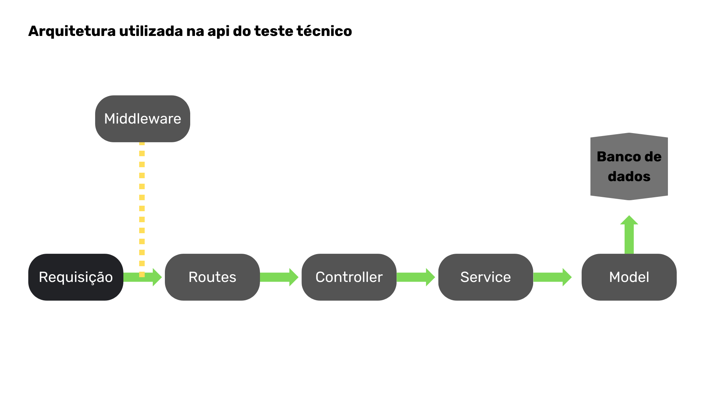

# Sistema de Processamento de Boletos

Este projeto foi desenvolvido como parte de um teste técnico. O objetivo principal é permitir o **upload de arquivos CSV ou PDF contendo boletos**, processá-los e armazená-los em um banco de dados relacional.

---

## Arquitetura e Organização

O sistema foi estruturado seguindo a separação de responsabilidades e boas práticas de clean code:

-   **Controllers:** Camada responsável por lidar com as requisições e respostas HTTP.
-   **Services:** Onde fica a lógica de negócio, como o processamento de arquivos.
-   **Models:** Representam as entidades do banco de dados, utilizando Sequelize.
-   **Middlewares:** Funções intermediárias para validações e controle de fluxo (ex: validação do tipo de arquivo).
-   **Routes:** Responsável por definir as rotas da API.
-   **Uploads:** Diretório temporário para armazenar os arquivos enviados.

## Imagem do Fluxo do Sistema

---

---

## Decisões Técnicas

-   **TypeScript:** Tipagem estática para maior confiabilidade e produtividade.
-   **Express:** Framework web leve e flexível para construir APIs REST.
-   **Multer:** Middleware para lidar com `multipart/form-data` no upload de arquivos.
-   **Sequelize:** ORM para abstração do banco de dados relacional.
-   **pdf-lib:** Biblioteca utilizada para manipulação de arquivos PDF.
-   **csv-parser:** Utilizada para fazer parsing de arquivos CSV.

### Por que essa arquitetura?

-   **Escalabilidade:** Separar lógica de controle e regra de negócio facilita futuras alterações e manutenção.
-   **Testabilidade:** A organização em services permite criação de testes unitários.
-   **Legibilidade:** Código modularizado é mais fácil de entender e evoluir.

---
